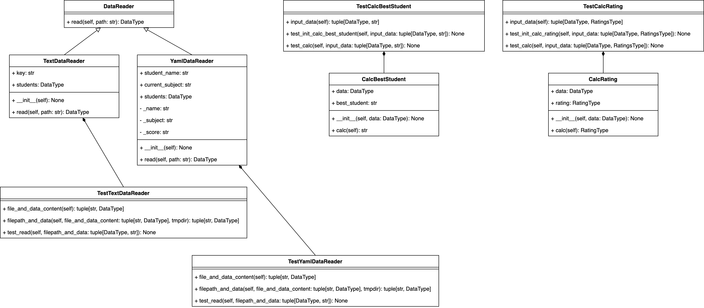

# Лабораторная 1 по дисциплине "Технологии программирования"

# Работа с приложением
## Запуск приложения
Для запуск приложения через консоль нужно выполнить следующую команду находясь в корневом каталоге проекта:
```bash
python3 src/main.py -p data/data.txt
```

Параметры запуска:
-p - путь к файлу содержащему оценки студентов

## Проверка кода на соотвествие стандарту PEP8
```bash
pycodestyle test src
```

## Запуск тестов
```bash
export PYTHONPATH="./:./src"
pytest test
```

# Тема лаюораторной работы
Знакомство с системой контроля версий Git и инструментом CI/CD GitHub Actions

# Цели работы
- Познакомиться c распределенной системой контроля версий кода Git и ее функциями;
- Познакомиться с понятиями «непрерывная интеграция» (CI) и «непрерывное развертывание»
(CD), определить их место в современной разработке программного обеспечения;
- Получить навыки разработки ООП-программ и написания модульных тестов к ним на
современных языках программирования;
- Получить навыки работы с системой Git для хранения и управления версиями ПО;
- Получить навыки управления автоматизированным тестированием программного обеспечения,
расположенного в системе Git, с помощью инструмента GitHub Actions.

# Индивидуальный вариант
| Формат входного файла | Расчётная процедура |
| - | - |
| YAML | Определить и вывести на экран студента, имеющего 90 баллов по всем дисциплинам. Если таких студентов несколько, нужно вывести любого из них. Если таких студентов нет, необходимо вывести сообщение об их отсутствии. |

# UML Диаграммы


# Выводы
Были изучены системы контроля версий Git, понятия CI/CD. Были полученны навыки разработки ООП-программ. Были реализиванны классы для выполнения поставленных задач в индивидуальном варианте. Были написанны модульные тесты, покрывающие большую часть написанного кода. Была составлена UML диаграмма классов.